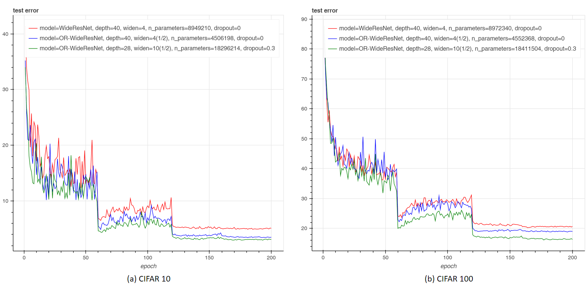
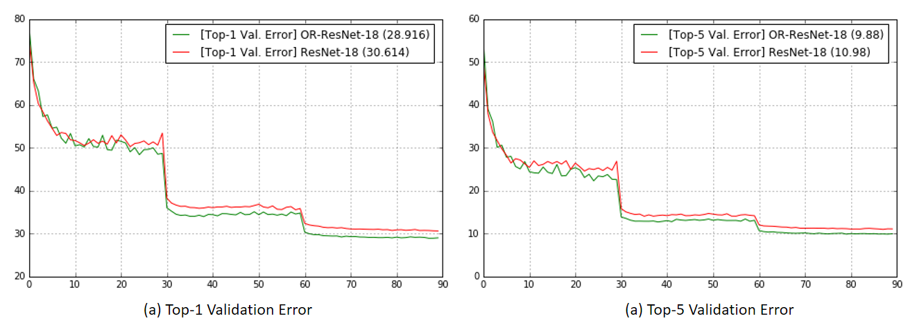

# Oriented Response Networks
[](https://github.com/ZhouYanzhao/ORN/tree/torch) [](#) [](#)

[[project]](http://zhouyanzhao.github.io/ORN) [[doc]](http://github.com/ZhouYanzhao/ORN) [[arXiv]](https://arxiv.org/pdf/1701.01833)


## Torch Implementation
The [torch branch](https://github.com/ZhouYanzhao/ORN/tree/torch) contains:

* the official **torch** implementation of ORN.
* the **MNIST-Variants** demo.

Please follow the instruction below to install it and run the experiment demo.

### Prerequisites
* Linux (tested on ubuntu 14.04LTS)
* NVIDIA GPU + CUDA CuDNN (CPU mode and CUDA without CuDNN mode are also available but significantly slower)
* [Torch7](http://torch.ch/docs/getting-started.html)

### Getting started
You can setup everything via a single command `wget -O - https://git.io/vHCMI | bash` **or** do it manually in case something goes wrong:

1. install the dependencies (required by the demo code):
    * [torchnet](https://github.com/torchnet/torchnet): `luarocks install torchnet`
    * [optnet](https://github.com/fmassa/optimize-net): `luarocks install optnet`

2. clone the torch branch: 
    ```bash
    # git version must be greater than 1.9.10
    git clone https://github.com/ZhouYanzhao/ORN.git -b torch --single-branch ORN.torch
    cd ORN.torch
    export DIR=$(pwd)
    ```

3. install ORN: 
    ```bash
    cd $DIR/install
    # install the CPU/GPU/CuDNN version ORN.
    bash install.sh
    ```

4. unzip the MNIST dataset:

    ```bash
    cd $DIR/demo/datasets
    unzip MNIST
    ```

5. run the MNIST-Variants demo:

    ```bash
    cd $DIR/demo
    # you can modify the script to test different hyper-parameters
    bash ./scripts/Train_MNIST.sh
    ```

### Trouble shooting
If you run into `'cudnn.find' not found`, update Torch7 to the latest version via `cd <TORCH_DIR> && bash ./update.sh` then re-install everything.

### More experiments

**CIFAR 10/100**

You can train the [OR-WideResNet](https://gist.github.com/ZhouYanzhao/c7f75cd8ea3c92e2044d71ac7bc30fab/raw/or-wrn.lua) model (converted from WideResNet by simply replacing Conv layers with ORConv layers) on CIFAR dataset with [WRN](https://github.com/szagoruyko/wide-residual-networks).
```bash
dataset=cifar10_original.t7 model=or-wrn widen_factor=4 depth=40 ./scripts/train_cifar.sh
```
With exactly the same settings, ORN-augmented WideResNet achieves state-of-the-art result while using significantly fewer parameters.



Network          | Params   | CIFAR-10 (ZCA) | CIFAR-10 (mean/std) | CIFAR-100 (ZCA) | CIFAR-100 (mean/std) 
-----------------|:--------:|:--------------:|:-------------------:|:---------------:|:--------------------:
WRN-40-4         | 8.9M     | 4.97 | 4.53 | 22.89 | 21.18 |
WRN-28-10-dropout| 36.5M    | 4.17 | 3.89 | 20.50 | 18.85 |
WRN-40-10-dropout| 55.8M    | -    | 3.80    | -  | 18.3  |
ORN-40-4(1/2)    | 4.5M     | 4.13 | 3.43 | 21.24 | 18.82 |
ORN-28-10(1/2)-dropout | 18.2M | 3.52 | **2.98** | 19.22 | **16.15** |

Table.1 Test error (%) on CIFAR10/100 dataset with flip/translation augmentation) 

**ImageNet**



The effectiveness of ORN is further verified on large scale data. The OR-ResNet-18 model upgraded from [ResNet-18](https://github.com/facebook/fb.resnet.torch) yields significant better performance when using similar parameters.

| Network      | Params | Top1-Error | Top5-Error |
|--------------|:------:|:----------:|:----------:|
| ResNet-18    |  11.7M |   30.614   |    10.98   |
| OR-ResNet-18 |  11.4M |   **28.916**   |    **9.88**    |

Table.2 Validation error (%) on ILSVRC-2012 dataset.

You can use [facebook.resnet.torch](https://github.com/facebook/fb.resnet.torch) to train the [OR-ResNet-18](https://gist.github.com/ZhouYanzhao/c7f75cd8ea3c92e2044d71ac7bc30fab/raw/or-resnet.lua) model from scratch or finetune it on your data by using the [pre-trained weights](https://1drv.ms/u/s!Avhhrlo9ASwciWcEjJ_KWBgTWWyg).

```lua
-- To fill the model with the pre-trained weights:
model = require('or-resnet.lua')({tensorType='torch.CudaTensor', pretrained='or-resnet18_weights.t7'})
```

A more specific demo notebook of using the pre-trained OR-ResNet to classify images can be found [here](classify.ipynb).

## PyTorch Implementation
coming

## Caffe Implementation 
coming

## Citation 
If you use the code in your research, please cite:
```bibtex
@INPROCEEDINGS{Zhou2017ORN,
    author = {Zhou, Yanzhao and Ye, Qixiang and Qiu, Qiang and Jiao, Jianbin},
    title = {Oriented Response Networks},
    booktitle = {CVPR},
    year = {2017}
}
```
